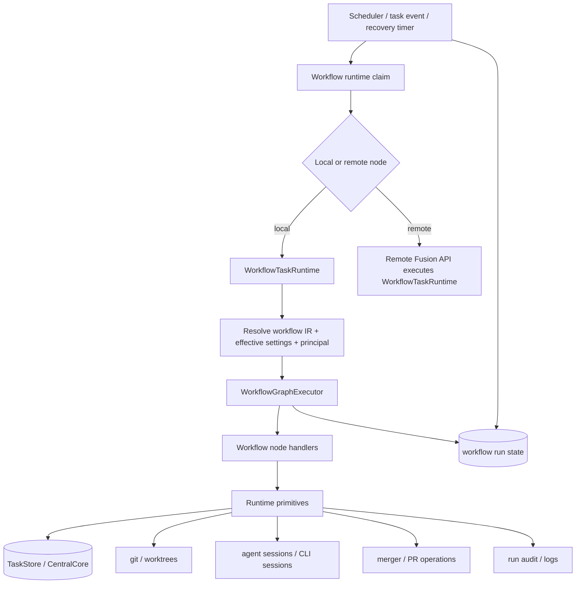
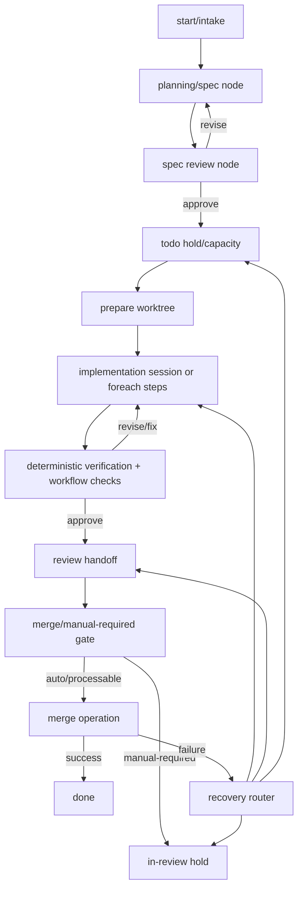
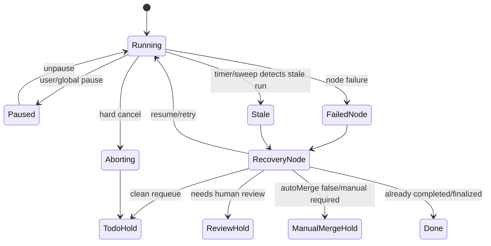

# refactor: Big-bang workflow-native execution cutover

## Summary

Replace Fusion's legacy executor/triage lifecycle with a workflow-native execution model in one coordinated cutover. Built-in workflows become the complete expression of default engine behavior, nodes own execution and recovery policy, and the engine remains the runtime substrate for scheduling, routing, persistence, concurrency, process supervision, storage, and audit plumbing.

---

## Problem Frame

The workflow stack already has a graph executor, built-in workflow IR, step inversion, workflow-defined columns, workflow settings, node handlers, custom nodes, PR nodes, and plugin workflow extensions. But executable tasks still pass through `TaskExecutor.execute()` and `TriageProcessor.specifyTask()` for most lifecycle policy. The current graph path uses seams and completion interceptors to call back into legacy executor logic, so the system has two control planes: workflow IR says it owns sequencing, while `executor.ts`, `triage.ts`, and self-healing sweeps still own planning, implementation, verification, review, merge routing, and recovery decisions.

This plan intentionally changes the migration posture. The target is not a parity-gated rollout with old-engine fallback. The target is a single big-bang replacement branch where workflow runtime becomes the only task lifecycle driver before merge. The implementation can be internally sequenced and heavily characterized, but the shipped state must not contain a production alternate path that reruns legacy executor orchestration.

---

## Requirements

- R1. All executable task lifecycle policy is represented by selected workflow IR, built-in workflow IR, node handlers, or workflow extension nodes.
- R2. Built-in workflows fully express the current default coding, stepwise coding, planning/specification, verification, review, merge, PR response, and recovery behavior.
- R3. The engine keeps scheduler dispatch, node routing, persistence adapters, concurrency/semaphore control, process supervision, storage access, and audit/log sinks.
- R4. The engine does not keep lifecycle policy hidden in `TaskExecutor.execute()`, `TriageProcessor.specifyTask()`, self-healing mutation sweeps, or graph-to-legacy completion interceptors.
- R5. Runtime mechanics are extracted as typed primitives that nodes can call: worktree preparation, session execution, command execution, artifact IO, task transition, merge operation, reviewer invocation, process abort, and audit emission.
- R6. Recovery is workflow/node-owned policy. Sweeps and timers may wake workflow recovery nodes, but they must not directly decide lifecycle repair behavior for task execution.
- R7. Existing invariants remain non-configurable: user move `in-progress -> todo` is hard cancel, `autoMerge:false` is terminal until human merge except scoped shared-branch member integration, file-scope and squash overlap guards remain authoritative, worktree ownership remains enforced, and branch-group merge target rules remain intact.
- R8. Effective execution principal resolution applies across every workflow execution surface, including custom nodes, planning nodes, coding nodes, step-execute, review nodes, heartbeat serialization, resume wakeups, permissions, and hot-swap/change detection.
- R9. A workflow run is durable and inspectable: current node, side-effect boundary, active sessions, branch/foreach instances, terminal outcome, recovery decision, and audit correlation are persisted or derivable through one runtime state model.
- R10. The shipped cutover has no production fallback to old lifecycle orchestration. If workflow runtime fails after merge, failure routes through workflow-defined recovery/parking behavior, not a legacy executor retry path.
- R11. Tests assert the invariant across all known execution surfaces: default workflow, stepwise workflow, custom workflow, plugin work engine extension, PR nodes, triage/planning, pause/cancel, auto-merge off, branch groups, workflow settings/test mode, cross-node runtime routing, and restart recovery.

---

## Scope Boundaries

### In Scope

- Promote `WorkflowTaskRuntime` into the only executable task runtime.
- Replace production `WorkflowLegacySeams` with first-class node handlers backed by typed runtime primitives.
- Move built-in triage/spec generation into workflow nodes and a built-in planning region.
- Move deterministic verification, pre-merge workflow steps, revision/fix routing, review handoff, merge/manual-required behavior, and completed-task recovery into built-in workflow IR.
- Convert self-healing execution repair into workflow recovery wakeups plus node-authored recovery branches.
- Preserve existing stores, task rows, task documents, reviewer implementation, merger implementation, agent runtimes, plugin runtime, and scheduler infrastructure as mechanics.
- Delete or demote old lifecycle orchestration so no production path depends on graph re-entry into `TaskExecutor.execute()`.

### Out of Scope

- Replacing SQLite storage or the task model identity.
- Rewriting git merge algorithms or GitHub PR operations.
- Rewriting agent runtime protocols.
- Redesigning dashboard workflow authoring UI beyond what is necessary to expose new built-in node kinds.
- Removing workflow authoring surfaces or plugin workflow extension surfaces.
- Changing published CLI release process.

### Deferred to Follow-Up Work

- Cosmetic cleanup of old file names after the cutover if the implementation leaves mechanically named modules like `executor-primitives.ts`.
- Broad dashboard UX redesign for workflow debugging beyond required runtime state display.
- New plugin APIs unrelated to execution/recovery ownership.

---

## Key Technical Decisions

- KTD-1. Big-bang means no production fallback. Implementation may use characterization tests and temporary adapters while the branch is under construction, but the final branch must remove old lifecycle dispatch and old fallback flags before merge.
- KTD-2. Workflow IR expresses policy; runtime primitives express mechanics. A node may call `prepareWorktree`, `runAgentSession`, `runReviewer`, or `requestMerge`, but the decision to call them, retry them, recover from them, or park the task belongs to the workflow graph.
- KTD-3. Built-in workflows are source of truth. `builtin:coding`, `builtin:stepwise-coding`, and any new built-in planning/recovery/PR workflows must encode the current engine logic rather than relying on comments or hidden `executor.ts` branches.
- KTD-4. Recovery becomes routable graph behavior. Timers and sweeps identify stale runtime state and enqueue recovery work; recovery nodes decide whether to resume, reset, requeue, park, request human review, or no-op.
- KTD-5. Preserve centralized invariants as substrate guards. File-scope enforcement, worktree ownership checks, transition validation, merge target resolution, auto-merge processing predicates, and process supervision stay centralized and are invoked by nodes as non-bypassable guards.
- KTD-6. Remove mutable per-task graph seam slots. Existing `graphCompletionInterceptors`, `graphStepRunOnce`, `graphSeamGoverningNodeId`, and similar slots are symptoms of graph-to-executor re-entry. Runtime state should be explicit per workflow run and per node/session.
- KTD-7. Effective principal is resolved once per node invocation and carried through all identity-sensitive subsystems. The column-agent blast-radius checklist applies to every node that can run a session or wake a session.
- KTD-8. Cross-node execution remains a runtime routing concern. A remote node executes the workflow runtime in its own process; the central node routes, monitors, and receives events. It does not execute task lifecycle policy locally for remote work.
- KTD-9. Characterization coverage is allowed; compatibility code is not. Tests may compare old behavior during implementation, but final production code should not keep old orchestration for rollback.

---

## High-Level Technical Design

### Ownership Boundary

The engine owns when a run may start, where it runs, how many concurrent units may execute, how subprocesses are supervised, and where state is stored. The workflow owns what happens next.

### Built-In Workflow Shape

The exact node names are implementation details, but every box above must be represented in built-in workflow IR or a built-in reusable subgraph. No box should be hidden inside a monolithic executor function.

### Recovery Model

Sweeps do not mutate task lifecycle directly. They materialize a workflow recovery event or wake the recovery node for a task/run. The recovery node then uses the same transition primitives and invariants as ordinary execution.

---

## Implementation Units

### U1. Runtime Primitive Boundary

- **Goal:** Extract lifecycle mechanics from `executor.ts`, `triage.ts`, and self-healing into typed primitives that workflow nodes can call without invoking legacy orchestration.
- **Requirements:** R3, R5, R7.
- **Dependencies:** None.
- **Files:** `packages/engine/src/runtime-primitives.ts` (new), `packages/engine/src/executor.ts`, `packages/engine/src/triage.ts`, `packages/engine/src/step-session-executor.ts`, `packages/engine/src/reviewer.ts`, `packages/engine/src/merger.ts`, `packages/engine/src/worktree-acquisition.ts`, `packages/engine/src/__tests__/runtime-primitives.test.ts`, `packages/engine/src/__tests__/executor-worktree.test.ts`, `packages/engine/src/__tests__/executor-step-session.test.ts`, `packages/engine/src/__tests__/base-commit-capture.real-git.test.ts`.
- **Approach:** Define primitive interfaces for worktree preparation, base/fork-point capture, task document/artifact IO, planning session execution, coding session execution, single-step execution, reviewer invocation, deterministic command execution, workflow-step execution, transition writes, merge request/merge operation, process abort, and audit emission. Move code behind those interfaces in small extractions, but keep behavior identical. Primitives must accept a workflow run context and node context so audit and effective principal are never inferred from task fields alone.
- **Execution note:** Characterization-first. Preserve old behavior with tests before extraction, especially worktree liveness, local-first base capture, file-scope checks, token persistence, and abort cleanup.
- **Patterns to follow:** `step-runner.ts` DI style, `worktree-acquisition.ts`, `base-commit-capture.ts`, `createRunAuditor`, and existing real-git tests.
- **Test scenarios:** worktree preparation refuses invalid/unowned worktrees; base capture uses local integration branch before origin; deterministic commands use async execution with timeout; abort cancels active sessions and subprocesses; reviewer primitive maps verdicts without mutating unrelated state; merge primitive honors branch-group targets; primitive audit includes run id, node id, and effective principal.
- **Verification:** Primitive tests pass independently of workflow graph tests; old executor characterization tests still pass while extraction is in progress.

### U2. Workflow Run State Authority

- **Goal:** Create one durable runtime state model for active workflow runs, side-effect boundaries, node progress, active sessions, recovery events, branch rows, and foreach instances.
- **Requirements:** R6, R9, R10.
- **Dependencies:** U1.
- **Files:** `packages/core/src/db.ts`, `packages/core/src/store.ts`, `packages/core/src/types.ts`, `packages/engine/src/workflow-task-runtime.ts`, `packages/engine/src/workflow-graph-executor.ts`, `packages/engine/src/workflow-graph-branches.ts`, `packages/engine/src/workflow-graph-foreach.ts`, `packages/core/src/__tests__/central-db.test.ts`, `packages/core/src/__tests__/store-workflow-runtime.test.ts` (new), `packages/engine/src/__tests__/workflow-task-runtime.test.ts`.
- **Approach:** Add or consolidate top-level workflow run records around the existing branch and foreach persistence. Persist run id, workflow id, current node, side-effect-started marker, active primitive/session ids, effective principal, terminal outcome, recovery event queue, and last activity timestamp. Keep branch and step-instance tables as detail tables keyed by the same run id.
- **Patterns to follow:** `workflow_run_branches`, `workflow_run_step_instances`, `runAuditEvents`, `transitionPending`.
- **Test scenarios:** a run starts once for a task; current node updates idempotently; active session ids clear on terminal outcomes; stale run rows prune without deleting current run rows; side-effect-started prevents fallback reruns; recovery events are append-only or idempotently consumed; restart can reconstruct active branches and foreach instances.
- **Verification:** Store/runtime tests prove workflow run state is sufficient to decide resume, abort, or park without inspecting `TaskExecutor` in-memory sets.

### U3. Built-In Workflow IR Full Lifecycle Expression

- **Goal:** Expand built-in workflows so they encode all default task lifecycle policy currently hidden in executor, triage, workflow-step orchestration, review handoff, merge handling, and recovery.
- **Requirements:** R1, R2, R4, R6, R7.
- **Dependencies:** U1, U2.
- **Files:** `packages/core/src/builtin-coding-workflow-ir.ts`, `packages/core/src/builtin-stepwise-coding-workflow-ir.ts`, `packages/core/src/builtin-pr-workflow-ir.ts`, `packages/core/src/workflow-ir-types.ts`, `packages/core/src/workflow-ir.ts`, `packages/core/src/builtin-workflows.ts`, `packages/core/src/__tests__/builtin-coding-workflow-ir.test.ts` (new), `packages/core/src/__tests__/builtin-stepwise-coding-workflow-ir.test.ts`, `packages/core/src/__tests__/workflow-ir.test.ts`, `packages/core/src/__tests__/workflow-ir-loop.test.ts`, `packages/core/src/__tests__/workflow-ir-foreach.test.ts`.
- **Approach:** Add built-in node kinds or reserved node configs for planning/spec generation, spec review, todo capacity hold, stale-spec handling, dependency gate, worktree preparation, implementation session, deterministic verification, pre-merge workflow checks, revision/fix loop, review handoff, merge/manual-required routing, post-merge checks, and recovery router. Prefer explicit built-in node kinds for non-authorable engine primitives; use prompt/script/code nodes for authorable behavior.
- **Patterns to follow:** Existing `parse-steps`, `foreach`, `loop`, `step-review`, `code`, PR node validation, and workflow setting declarations.
- **Test scenarios:** built-in coding workflow validates; null workflow selection resolves to the built-in workflow; default workflow includes every legacy phase in a phase-map test; stepwise workflow includes parse/foreach/review/rework; `executionMode: "fast"` bypasses pre-merge checks but not post-merge checks; `autoMerge:false` routes to manual-required hold; branch-group member integration routes to member landing; malformed built-in IR fails tests at parse time.
- **Verification:** Core tests make built-in IR the explicit compatibility contract before runtime dispatch changes.

### U4. Node Handler Runtime

- **Goal:** Replace production legacy seam handlers with node handlers that call runtime primitives directly.
- **Requirements:** R1, R4, R5, R8, R10.
- **Dependencies:** U1, U2, U3.
- **Files:** `packages/engine/src/workflow-node-handlers.ts`, `packages/engine/src/workflow-task-runtime.ts`, `packages/engine/src/workflow-graph-executor.ts`, `packages/engine/src/pr-nodes.ts`, `packages/engine/src/code-node-runner.ts`, `packages/engine/src/__tests__/workflow-node-handlers.test.ts`, `packages/engine/src/__tests__/workflow-node-handler-extensions.test.ts`, `packages/engine/src/__tests__/workflow-verdict-provider-extensions.test.ts`, `packages/engine/src/__tests__/code-node.test.ts`.
- **Approach:** Implement handlers for the new built-in lifecycle nodes and rework existing prompt/script/gate behavior so seam configuration is no longer a production path. Custom prompt/script/gate/code nodes continue to use custom-node machinery. Handler results should produce explicit outcome values like `spec-approved`, `capacity-blocked`, `implementation-complete`, `revision-requested`, `workflow-check-failed`, `manual-required`, `merge-timeout`, `recover-resume`, and `recover-park-review`.
- **Patterns to follow:** `createParseStepsHandler`, `createStepReviewHandler`, `createPrNodeHandlers`, plugin node-handler fallback/degradation.
- **Test scenarios:** planning node writes expected artifacts and step projection; implementation node invokes coding primitive once; verification node routes revise vs approve; workflow-check node handles gate/advisory modes; merge node honors manual-required; recovery node consumes recovery event and routes to the correct edge; missing primitive wiring fails closed; plugin node handler degradation never bypasses built-in guard nodes.
- **Verification:** Node handler tests cover success/failure for every built-in lifecycle node kind without using `TaskExecutor.execute()`.

### U5. Planning And Triage Workflow Nodes

- **Goal:** Move built-in triage/specification behavior out of `TriageProcessor` lifecycle orchestration and into planning workflow nodes.
- **Requirements:** R1, R2, R4, R6, R11.
- **Dependencies:** U1, U2, U3, U4.
- **Files:** `packages/engine/src/triage.ts`, `packages/engine/src/workflow-node-handlers.ts`, `packages/engine/src/workflow-task-runtime.ts`, `packages/engine/src/agent-tools.ts`, `packages/engine/src/__tests__/triage-core.test.ts`, `packages/engine/src/__tests__/triage-soft-delete-abort.test.ts`, `packages/engine/src/__tests__/workflow-planning-nodes.test.ts` (new), `packages/engine/src/__tests__/reliability-interactions/ghost-bug-preflight.test.ts`.
- **Approach:** Extract triage session mechanics into planning primitives, then create planning/spec-review nodes in built-in workflows. The scheduler can still identify intake tasks and respect capacity, but planning behavior is a workflow region. Tools like task creation, task document writing, spec review, ghost-bug preflight, duplicate detection, and starved refinement recovery must be called by nodes or recovery branches.
- **Patterns to follow:** Existing prompt layer construction in `triage.ts`, `fn_task_create` tool surface, task document APIs, ghost-bug preflight tests.
- **Test scenarios:** intake task runs planning node and writes `PROMPT.md`; spec review APPROVE routes to todo hold; REVISE routes back to planning; split-into-subtasks path creates child tasks and parks parent according to existing behavior; soft-deleted task aborts planning; orphaned planning session recovery wakes recovery node instead of directly clearing status.
- **Verification:** Triage behavior tests pass through workflow runtime, and no production path calls `TriageProcessor.specifyTask()` as lifecycle owner.

### U6. Scheduler, Routing, And Dispatch Cutover

- **Goal:** Route all executable work through `WorkflowTaskRuntime` while keeping scheduling, node routing, concurrency, and remote runtime boundaries in the engine.
- **Requirements:** R1, R3, R8, R10, R11.
- **Dependencies:** U2, U3, U4, U5.
- **Files:** `packages/engine/src/scheduler.ts`, `packages/engine/src/runtimes/in-process-runtime.ts`, `packages/engine/src/runtimes/remote-node-runtime.ts`, `packages/engine/src/runtimes/remote-node-client.ts`, `packages/engine/src/project-manager.ts`, `packages/engine/src/hybrid-executor.ts`, `packages/engine/src/executor.ts`, `packages/engine/src/__tests__/scheduler-node-routing.test.ts`, `packages/engine/src/__tests__/hybrid-executor-multi-node-routing.test.ts`, `packages/engine/src/runtimes/__tests__/remote-node-runtime.test.ts`, `packages/engine/src/__tests__/cross-node-claim-mutex.integration.test.ts`.
- **Approach:** Replace `TaskExecutor.execute()` dispatch ownership with runtime dispatch ownership. Keep remote nodes as remote workflow runtimes: local central routing sends execute requests/events, but the remote side resolves and executes the workflow. Concurrency limits are acquired by the runtime before side-effecting nodes and released by terminal/paused outcomes. Existing task-moved and heartbeat wake paths should call the runtime facade.
- **Patterns to follow:** `ProjectRuntime` boundary, `RemoteNodeRuntime`, `executingTaskLock`, node routing policy tests.
- **Test scenarios:** local task dispatch starts one workflow run; remote task dispatch calls remote execute API and streams events; duplicate dispatch is claimed once; unavailable node policy still blocks or falls back according to settings; heartbeat completion wakes tasks by effective principal; workflow runtime respects global pause and engine pause before starting new side effects.
- **Verification:** Scheduler and runtime tests show no dispatch path invokes legacy executor lifecycle.

### U7. Recovery As Workflow Policy

- **Goal:** Convert execution self-healing and restart recovery from direct lifecycle mutations into workflow recovery events handled by recovery nodes.
- **Requirements:** R6, R7, R9, R10, R11.
- **Dependencies:** U2, U4, U6.
- **Files:** `packages/engine/src/self-healing.ts`, `packages/engine/src/restart-recovery-coordinator.ts`, `packages/engine/src/recovery-policy.ts`, `packages/engine/src/auto-recovery.ts`, `packages/engine/src/auto-recovery-handlers/branch-worktree.ts`, `packages/engine/src/auto-recovery-handlers/contamination.ts`, `packages/engine/src/auto-recovery-handlers/file-scope.ts`, `packages/engine/src/workflow-task-runtime.ts`, `packages/engine/src/__tests__/self-healing.test.ts`, `packages/engine/src/__tests__/workflow-recovery-nodes.test.ts` (new), `packages/engine/src/__tests__/reliability-interactions/workflow-interpreter-cutover.test.ts`, `packages/engine/src/__tests__/reliability-interactions/active-worktree-removal-liveness.test.ts`.
- **Approach:** Keep sweep timing and detection in the engine, but change detected conditions into typed recovery events on the workflow run. Built-in recovery nodes handle completed-but-stranded work, failed pre-merge checks, no-progress no-task-done, partial-progress no-task-done, in-progress limbo, missing worktree review failure, contamination recovery, file-scope recovery, branch conflict recovery, stale planning, and orphaned sessions. Some non-task agent/heartbeat recovery can remain engine-owned when it is not task lifecycle policy.
- **Patterns to follow:** `recovery-policy.ts`, run audit events, `allowsAutoMergeProcessing`, branch-group recovery tests.
- **Test scenarios:** completed stranded task routes through recovery node to review handoff; failed pre-merge check routes to fix loop; no-progress failure cleanly requeues through todo hold; partial-progress failure preserves progress; contamination recovery routes to human review when unique commits remain; `autoMerge:false` in-review tasks are inspected but not moved backward; branch-group member landing uses group target; recovery events are idempotent across repeated sweeps.
- **Verification:** Reliability interaction tests prove sweeps no longer mutate execution lifecycle directly and recovery outcomes are authored by workflow nodes.

### U8. Effective Principal And Permission Surface Audit

- **Goal:** Re-key every execution identity, permission, serialization, wakeup, and hot-swap reader to use the node's effective principal.
- **Requirements:** R8, R11.
- **Dependencies:** U4, U6.
- **Files:** `packages/engine/src/executor.ts`, `packages/engine/src/agent-heartbeat.ts`, `packages/engine/src/workflow-task-runtime.ts`, `packages/engine/src/session-skill-context.ts`, `packages/engine/src/agent-tools.ts`, `packages/engine/src/action-gate.ts` or adjacent action gate modules, `packages/core/src/workflow-ir-resolver.ts`, `packages/core/src/workflow-columns-settings.ts`, `packages/engine/src/__tests__/agent-workflow-tools-exposure.test.ts`, `packages/engine/src/__tests__/agent-tools-workflow-settings.test.ts`, `packages/engine/src/__tests__/executor-column-agent-custom-node.test.ts`, `packages/engine/src/__tests__/effective-node.test.ts`.
- **Approach:** Centralize effective principal resolution for each node invocation. Pass the resolved identity through session setup, prompt/persona/memory, permission gates, heartbeat serialization in both directions, resume queries, change detection, audit attribution, and missing-agent fallback. Search all `assignedAgentId` execution readers and either re-key them or document why they are task metadata readers only.
- **Execution note:** Apply the full checklist from `docs/solutions/architecture-patterns/per-entity-execution-principal-override-blast-radius.md`.
- **Patterns to follow:** Existing column-agent resolver, `resolveEffectiveAgent`, heartbeat serialization guards.
- **Test scenarios:** override column agent governs custom prompt node, planning node, coding node, step-execute, and review node; defer mode loses to own agent/model settings; missing agent degrades; heartbeat does not run concurrently with its effective task session; resume wakes by effective principal; permission gate sees the effective agent.
- **Verification:** Identity matrix tests cover mode x surface x own-settings x missing-agent.

### U9. Old Orchestration Deletion

- **Goal:** Remove production lifecycle orchestration from `TaskExecutor`, `TriageProcessor`, graph seams, and self-healing callbacks after workflow runtime and built-ins cover the behavior.
- **Requirements:** R4, R10, R11.
- **Dependencies:** U1, U2, U3, U4, U5, U6, U7, U8.
- **Files:** `packages/engine/src/executor.ts`, `packages/engine/src/triage.ts`, `packages/engine/src/workflow-graph-task-runner.ts`, `packages/engine/src/workflow-authoritative-driver.ts`, `packages/engine/src/workflow-task-runtime.ts`, `packages/engine/src/workflow-node-handlers.ts`, `packages/engine/src/__tests__/workflow-graph-entry.test.ts` if present, `packages/engine/src/__tests__/stepwise-workflow-parity.test.ts`, `packages/engine/src/__tests__/executor-core.test.ts`.
- **Approach:** Delete `maybeExecuteWorkflowGraph`, `runImplementationPhase`, `graphCompletionInterceptors`, production `WorkflowLegacySeams`, authoritative-driver fallback, dual-observe gating for production authority, triage lifecycle loops, and self-healing callbacks that directly call executor/triage recovery methods. Keep or rename files only when they contain primitives. Any remaining `executor.ts` code should be mechanical session/worktree/tool support, not lifecycle owner.
- **Patterns to follow:** Search-based deletion gates used in existing no-nohup and lazy-view inventory tests.
- **Test scenarios:** search tests fail if production code references `graphCompletionInterceptors`, `runImplementationPhase`, `maybeExecuteWorkflowGraph`, `WorkflowAuthoritativeDriver`, or production `WorkflowLegacySeams`; runtime tests prove null workflow selection executes built-in workflow; no tests need legacy fallback to pass.
- **Verification:** A grep audit plus tests show no production lifecycle path bypasses workflow runtime.

### U10. Surface Enumeration And Gate Test Matrix

- **Goal:** Build the regression matrix required for a big-bang cutover across every known execution surface.
- **Requirements:** R7, R8, R10, R11.
- **Dependencies:** U3, U4, U5, U6, U7, U8, U9.
- **Files:** `packages/engine/src/__tests__/workflow-runtime-cutover.matrix.test.ts` (new), `packages/engine/src/__tests__/workflow-work-engine-dispatch.test.ts`, `packages/engine/src/__tests__/pr-workflow-e2e.test.ts`, `packages/engine/src/__tests__/workflow-step-integration-cwd.test.ts`, `packages/engine/src/__tests__/reliability-interactions/workflow-and-file-scope.test.ts`, `packages/engine/src/__tests__/reliability-interactions/owning-node-unavailable-interactions.test.ts`, `packages/engine/src/__tests__/reliability-interactions/cross-node-assignment-wake.test.ts`, `packages/engine/src/__tests__/reliability-interactions/workflow-interpreter-cutover.test.ts`, `packages/engine/vitest.config.ts`.
- **Approach:** Enumerate surfaces explicitly and add targeted tests rather than relying on old executor suites. Cover default workflow, stepwise workflow, custom prompt/script/gate/code nodes, plugin work-engine extension, PR nodes, planning nodes, recovery nodes, local runtime, remote runtime, pause/cancel, branch-group integration, auto-merge global/per-task matrix, test mode/mock provider, workflow settings fallback, and file-scope/squash guards.
- **Patterns to follow:** `docs/testing.md` Surface Enumeration checklist, existing reliability-interactions tests, thin trusted gate constraints.
- **Test scenarios:** every surface above has at least one happy path and one failure/recovery path; gate suite gets only high-signal cutover invariants; slow/full-suite coverage remains opt-in unless evidence supports gate admission.
- **Verification:** `pnpm test:gate`, `pnpm lint`, `pnpm build`, and targeted engine/core suites pass without relying on old executor fallback.

### U11. Documentation And Concept Refresh

- **Goal:** Update docs and vocabulary so the repository describes workflow-native execution as the actual architecture.
- **Requirements:** R1, R2, R3, R6, R9.
- **Dependencies:** U9, U10.
- **Files:** `docs/architecture.md`, `docs/workflow-steps.md`, `docs/testing.md`, `docs/agents.md`, `docs/settings-reference.md`, `CONCEPTS.md`, `packages/engine/CHANGELOG.md`, `packages/engine/src/__tests__/workflow-settings-fallback-alignment.test.ts`.
- **Approach:** Replace interpreter-scaffold and parity-gated rollout language with the new ownership boundary. Add Concepts entries for Workflow runtime, Runtime primitive, Recovery event, and Built-in lifecycle node. Document what remains engine-owned and what is workflow-owned. Update testing docs with the new cutover matrix and recovery-node pattern.
- **Patterns to follow:** Existing Concepts style, Architecture package responsibility tables, workflow-steps IR sections.
- **Test scenarios:** documentation inventory tests still pass; lazy-heavy view inventory is unaffected; workflow settings docs describe built-in workflow settings as runtime-owned defaults.
- **Verification:** Docs use current code names and no longer describe legacy executor/reviewer/merger/scheduler flow as authoritative for task lifecycle.

---

## Surface Enumeration

The cutover must cover these surfaces before it can be considered complete:

| Surface | Required coverage |
|---|---|
| Default coding workflow | planning, implementation, verification, review, merge, failure, recovery |
| Stepwise coding workflow | parse-steps, foreach, step-execute, step-review, rework, integration conflict |
| Custom workflows | prompt, script, gate, code, split/join, loop, plugin node handler fallback |
| Planning/triage | new task intake, refinement, split subtasks, spec review, duplicate/ghost preflight |
| Recovery | completed stranded, failed pre-merge, no-progress, partial-progress, limbo, contamination, branch conflict |
| Merge | global auto-merge on/off, per-task override, manual-required, branch-group member landing, group promotion |
| Runtime routing | local runtime, remote node runtime, unavailable-node policy, cross-node assignment wake |
| Identity | assigned agent, column-agent defer, column-agent override, missing agent fallback, heartbeat serialization |
| Safety guards | hard cancel, file-scope guard, squash overlap, worktree ownership, process abort |
| Settings | workflow settings defaults, task overrides, test mode/mock provider, model lane resolution |
| Plugins | workflow work engine extension, node-handler extension degradation, PR node dependencies |

---

## System-Wide Impact

This is a high-risk architectural replacement. It changes the mental model for every developer-facing execution path: instead of learning `scheduler -> executor -> workflow steps -> review -> merge -> self-healing`, readers should learn `scheduler/router -> workflow runtime -> graph nodes -> primitives`. The user-visible behavior should remain recognizable, but the authorship surface changes: default behavior is inspectable in built-in workflows, and recovery decisions are visible as graph edges or recovery nodes.

Stakeholders affected:

- Developers need new runtime primitive and node-handler patterns.
- Reviewers need to inspect built-in workflow IR as executable policy.
- Operators/support gain durable workflow run state but lose the old executor-log-only mental model.
- Plugin authors must treat workflow extension handlers as first-class execution participants.
- Users should see fewer stranded tasks because recovery decisions become explicit and inspectable.

---

## Risks & Mitigations

| Risk | Mitigation |
|---|---|
| The big-bang branch is too large to reason about | Keep implementation units independently testable, but require final deletion of legacy orchestration before merge. |
| Hidden lifecycle behavior in `executor.ts` is missed | U3 phase-map tests and U10 surface enumeration must map every current branch before deletion. |
| Recovery becomes less safe during the cutover | U2 run state and U7 recovery events land before old sweeps are demoted. |
| Auto-merge/manual-required regresses | Preserve `allowsAutoMergeProcessing`, branch-group merge target resolution, and merger authority as substrate guards; cross global x per-task tests. |
| Effective principal is partially re-keyed | U8 applies the full blast-radius checklist and grep audit for old identity readers. |
| Built-in workflow IR becomes unreadable | Use reusable built-in subgraphs or explicit node kinds for engine-owned primitives; do not encode everything as opaque prompt nodes. |
| Tests become slow or flaky | Put only high-signal cutover invariants in the gate; keep broader matrix targeted and avoid real polling/network. |

---

## Acceptance Examples

- AE1. Given a task with no workflow selection, when the scheduler dispatches it, then `WorkflowTaskRuntime` resolves `builtin:coding` and no production code invokes legacy executor lifecycle fallback.
- AE2. Given a new task in intake, when planning starts, then a workflow planning node produces/reviews the spec and routes to todo hold without `TriageProcessor` owning lifecycle control.
- AE3. Given a coding task completes implementation, when verification fails with revision feedback, then workflow edges route back to the implementation/fix node and preserve existing progress semantics.
- AE4. Given `settings.autoMerge:false` and no per-task override, when the merge gate is reached, then the workflow routes to manual-required/in-review hold and self-healing does not move the task backward.
- AE5. Given `settings.autoMerge:false` and `task.autoMerge:true`, when the merge gate is reached, then trigger processing is allowed and the merge node proceeds through the normal merge primitive.
- AE6. Given a user moves an active task from `in-progress` to `todo`, when any node-owned session or command is active, then the runtime aborts it and parks the task with user-paused hard-cancel semantics.
- AE7. Given a crashed run with side effects already started, when restart recovery runs, then the scheduler wakes a workflow recovery event and does not rerun old executor orchestration.
- AE8. Given a column-agent override on a workflow column, when any node in that column runs, then session identity, permission gates, heartbeat serialization, and audit attribution all use the effective principal.
- AE9. Given a remote node owns a project, when central dispatches a task, then the remote node executes the workflow runtime and central only observes/routes events.

---

## Documentation / Operational Notes

- The final branch changes architecture docs, not just code. `docs/architecture.md` must describe workflow runtime as authoritative.
- `docs/workflow-steps.md` must stop describing `workflowGraphExecutor` and `workflowInterpreterAuthoritative` as rollout flags for production authority once the cutover lands.
- `CONCEPTS.md` should add Workflow runtime, Runtime primitive, Recovery event, and Built-in lifecycle node.
- This change affects private packages, but if behavior in published `@runfusion/fusion` changes through CLI/runtime behavior, the implementation work should add an appropriate changeset.

---

## Sources & Research

- `docs/plans/2026-06-07-001-refactor-workflow-runtime-cutover-plan.md` is the closest prior plan and is superseded here by the user's big-bang requirement.
- `docs/plans/2026-06-03-002-feat-workflow-interpreter-cutover-plan.md` documents the earlier seam/fallback interpreter path that this plan removes.
- `docs/plans/2026-06-04-001-feat-step-inversion-workflow-modelable-steps-plan.md` documents parse-steps, foreach, step-review, code nodes, and step-instance persistence.
- `docs/workflow-steps.md` documents current workflow IR, step inversion, workflow steps, parity flags, and reliability invariants.
- `CONCEPTS.md` defines Task, Default workflow, Step instance, In-review, Merge queue, Manual-required, Self-healing sweep, Column agent, and Effective agent.
- `docs/solutions/architecture-patterns/per-entity-execution-principal-override-blast-radius.md` supplies the identity blast-radius checklist used by U8.
- `docs/solutions/logic-errors/per-task-auto-merge-override-ignored-by-trigger-gates.md` supplies the additive trigger-gate lesson used by merge/recovery tests.
- `docs/solutions/logic-errors/files-changed-inflated-by-origin-first-base-commit.md` supplies the local-first fork-point invariant used by U1.
- `packages/engine/src/workflow-task-runtime.ts`, `workflow-graph-executor.ts`, `workflow-node-handlers.ts`, `workflow-graph-foreach.ts`, and `workflow-graph-loop.ts` are the existing workflow runtime foundation.
- `packages/engine/src/executor.ts`, `triage.ts`, `self-healing.ts`, `scheduler.ts`, and `runtimes/in-process-runtime.ts` are the legacy ownership surfaces to subsume.
