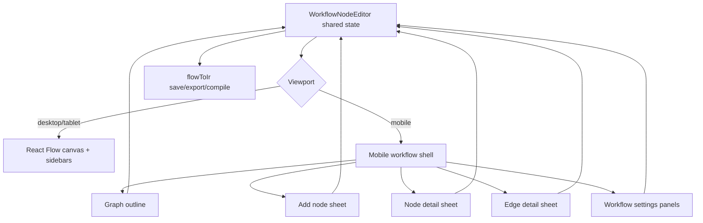

# feat: Redesign mobile workflow editor

## Summary

Redesign the workflow editor for mobile so graph authoring, workflow settings, node creation, and node editing are usable without desktop canvas precision. The implementation keeps the existing workflow IR, save flow, and React Flow desktop editor intact, while adding mobile-first navigation and editing surfaces around the same state.

---

## Problem Frame

The current workflow editor has mobile overrides, but the core mobile experience still asks users to manage a dense React Flow canvas, horizontal toolbars, sidebar disclosures, and inspector panels in a desktop-shaped modal. Fusion's strategy treats mobile as a first-class surface, and workflow settings are now a core workflow-authoring surface, so mobile users need a clean way to inspect the graph, add nodes, edit nodes, and manage workflow settings without hidden options or cramped controls.

---

## Requirements

**Mobile graph comprehension**

- R1. Mobile users can understand a workflow's node order, branches, loops, foreach regions, and column placement through a structured mobile graph view.
- R2. The mobile graph view exposes enough topology to select nodes and edges without requiring precise canvas panning, zooming, or edge tapping.
- R3. Desktop React Flow behavior remains available and unchanged outside the mobile viewport.

**Workflow and graph authoring**

- R4. Mobile users can create workflows, select workflows, rename workflows, edit descriptions, save, delete, export, import, auto-layout, and use AI design actions with no loss of existing editor capability.
- R5. Mobile users can add every palette node kind and every available template source through a touch-friendly add flow.
- R6. Mobile users can edit every node kind's existing inspector options through a panel or sheet that preserves the current validation and dirty-state behavior.
- R7. Mobile users can edit edge conditions and rework edge metadata through a mobile-friendly edge details surface.

**Workflow settings and related panels**

- R8. Workflow settings Definitions and Values are first-class mobile destinations, with built-in declarations read-only and Values editable as they are today.
- R9. Workflow columns and workflow fields remain reachable on mobile without being buried under the workflow list.
- R10. Project-bound workflow setting values preserve the existing stale-project notice, orphaned values disclosure, model dropdown behavior, and single Save values authority.

**Quality and accessibility**

- R11. Mobile controls use stable touch targets, do not introduce horizontal overflow, and avoid text overlap at mobile widths.
- R12. The redesign preserves keyboard and screen-reader semantics for dialogs, tabs, lists, buttons, selected items, and graph details.
- R13. Existing dashboard action button contracts are preserved unless a control is moved into a mobile-only workflow editor layout.

---

## Key Technical Decisions

- KTD1. Shared editor state, mobile-specific presentation: keep `WorkflowNodeEditor` as the owner of workflow selection, nodes, edges, columns, fields, settings, dirty tracking, and save/delete/import/export actions, then introduce mobile views that consume and mutate that same state.
- KTD2. Structured graph view over miniature canvas: mobile should default to a readable node/edge list that summarizes topology and opens node or edge details, while React Flow remains the desktop graph editor and can still exist as a secondary preview if implementation needs it.
- KTD3. Bottom-sheet style authoring flows: node add, node details, edge details, workflow settings, columns, and fields should open as mobile sheets or full-height panels with explicit headings and back paths rather than stacked sidebars.
- KTD4. Reuse current IR mapping: derive mobile graph rows from `irToFlow`/current `nodes` and `edges`, and save through the existing `flowToIr` path so mobile and desktop cannot drift in serialization.
- KTD5. Preserve workflow settings authorities: settings declarations continue to ride the workflow IR Save flow, while per-project Values continue to save through `WorkflowSettingsPanel` and its workflow setting value endpoints.
- KTD6. Feature-complete mobile first, polish second: the first implementation should expose all existing meaningful options before refining visual density, because hidden or missing workflow controls are the main failure mode.

---

## High-Level Technical Design

The mobile shell should be a presentation layer over the existing editor state. It should not introduce a parallel workflow document model, a mobile-only serializer, or separate settings persistence.

---

## Scope Boundaries

- In scope: workflow editor mobile layout, graph editor mobile representation, workflow settings mobile access, add-node flow, node editing, edge editing, columns, fields, and tests for mobile behavior.
- In scope: lightweight component extraction where it reduces duplication between desktop inspector logic and mobile sheets.
- Out of scope: broader dashboard navigation redesign, runtime workflow semantics, workflow IR schema changes, external workflow marketplace work, and changes to established dashboard header action buttons.
- Out of scope: replacing React Flow on desktop or changing desktop graph gestures.

---

## System-Wide Impact

This is a dashboard-only authoring change. The engine, workflow runtime, workflow settings value authority, and workflow IR compiler should see the same persisted definitions they see today. The main cross-cutting concern is avoiding a second interpretation of workflow topology: mobile graph summaries must be generated from the same flow nodes and edges that the desktop editor already saves.

---

## Implementation Units

### U1. Extract Mobile Graph Summaries

**Goal:** Add a pure summary layer that turns current editor nodes, edges, columns, and catalogs into mobile-friendly graph rows.

**Requirements:** R1, R2, R3, R12

**Dependencies:** None

**Files:**

- `packages/dashboard/app/components/workflow-mobile-graph.ts` (new)
- `packages/dashboard/app/components/__tests__/workflow-mobile-graph.test.ts` (new)
- `packages/dashboard/app/components/workflow-flow-mapping.ts`
- `packages/dashboard/app/components/nodes/node-summary.ts`

**Approach:** Build a pure helper that groups user-authored nodes, edge labels, incoming/outgoing connections, foreach and loop children, and column names into a compact data model for mobile rendering. The helper should accept the current React Flow node/edge arrays rather than persisted IR so it reflects unsaved edits. Column band nodes and start/end nodes need explicit treatment so the graph reads as workflow structure rather than React Flow implementation detail.

**Patterns to follow:** `nodeConfigSummary` in `packages/dashboard/app/components/nodes/node-summary.ts`; mapping constants and child-id helpers in `packages/dashboard/app/components/workflow-flow-mapping.ts`.

**Test scenarios:**

- Given a linear workflow, the summary returns ordered rows with node labels, kinds, and outgoing success destinations.
- Given split/join branching edges, the summary preserves multiple outgoing destinations and edge labels.
- Given a foreach or loop group with template children, the summary nests or associates template rows without exposing namespaced child ids as primary workflow ids.
- Given v2 columns, rows include column display names and ignore column band group nodes.
- Given long labels and missing config summaries, the helper returns stable fallback labels without throwing.

**Verification:** Mobile graph summary tests cover linear, branching, grouped, and columned workflows without mounting React Flow.

### U2. Add Mobile Workflow Shell Navigation

**Goal:** Replace the current mobile two-stage list/canvas layout with a mobile workflow shell that has clear destinations for Graph, Add, Settings, Fields, Columns, and workflow actions.

**Requirements:** R3, R4, R8, R9, R11, R12, R13

**Dependencies:** U1

**Files:**

- `packages/dashboard/app/components/WorkflowNodeEditor.tsx`
- `packages/dashboard/app/components/WorkflowNodeEditor.css`
- `packages/dashboard/app/components/__tests__/WorkflowNodeEditor.test.tsx`
- `packages/dashboard/app/components/__tests__/WorkflowNodeEditor.css.test.ts`

**Approach:** Keep the desktop render path intact. In the mobile branch, render a dedicated shell after workflow selection with a compact header, workflow identity strip, primary graph view, and explicit mobile navigation controls. Existing actions such as Save, Delete, Export, Import, Auto-layout, and Design with AI should remain reachable but may move into a mobile action menu or toolbar designed for touch. The workflow list should remain the entry point on mobile, with a clear back path.

**Patterns to follow:** existing `useViewportMode` gating in `WorkflowNodeEditor.tsx`; mobile full-screen modal rules and touch-target token in `WorkflowNodeEditor.css`; Header mobile overflow tests for accessible compact menus.

**Test scenarios:**

- On mobile with workflows loaded, the editor opens on the workflow list with no active workflow preselected.
- Selecting a workflow opens the mobile shell and hides the desktop sidebar/canvas/inspector stack.
- The mobile shell exposes Graph, Settings, Fields, Columns, and Add destinations for editable workflows.
- Built-in workflows expose read-only state plus duplicate/export affordances and do not show destructive edit controls.
- Save/Delete/Export/Auto-layout/AI actions remain reachable on mobile and call the same handlers as desktop.
- Desktop viewport still renders the existing React Flow editor path.
- CSS tests assert no horizontal overflow rules regress and touch-target rules stay mobile-scoped.

**Verification:** Existing mobile stage tests continue to pass or are updated to the new shell contract, and CSS contract tests prove the mobile shell remains full-screen, scrollable, and overflow-safe.

### U3. Implement Mobile Graph Outline View

**Goal:** Render the workflow graph in a mobile-friendly way that supports node and edge selection without canvas precision.

**Requirements:** R1, R2, R6, R7, R11, R12

**Dependencies:** U1, U2

**Files:**

- `packages/dashboard/app/components/MobileWorkflowGraphView.tsx` (new)
- `packages/dashboard/app/components/MobileWorkflowGraphView.css` (new)
- `packages/dashboard/app/components/WorkflowNodeEditor.tsx`
- `packages/dashboard/app/components/__tests__/MobileWorkflowGraphView.test.tsx` (new)
- `packages/dashboard/app/components/__tests__/WorkflowNodeEditor.test.tsx`

**Approach:** Add a mobile graph view that renders each workflow node as a stable row with icon, label, kind, summary, column, and connection chips. Tapping a node opens node details; tapping an edge chip opens edge details. The view should include start/end context but avoid making structural nodes look editable. For complex graphs, branch groups and template children should read as expandable sections rather than a zoomed-out diagram.

**Patterns to follow:** icon mapping in `WorkflowNodeTypes.tsx`; summary text from `nodeConfigSummary`; mobile no-overlap expectations from existing mobile CSS tests.

**Test scenarios:**

- Linear workflow rows render in graph order and expose node details buttons.
- Branching workflow rows show multiple outgoing edge chips and can open edge details for each edge.
- Foreach and loop rows show expandable template content with child nodes.
- Start/end rows render as context and do not expose edit/delete node controls.
- Long labels wrap or truncate without causing horizontal scroll.
- Selecting a node in the outline updates the existing selected node state.

**Verification:** The graph outline is usable in jsdom tests without React Flow canvas interaction, and selection state still drives the shared inspector/detail logic.

### U4. Convert Add Node and Template Insertion to Mobile Sheets

**Goal:** Make adding nodes and templates on mobile a categorized, searchable sheet instead of a horizontally scrolling palette.

**Requirements:** R5, R11, R12

**Dependencies:** U2, U3

**Files:**

- `packages/dashboard/app/components/MobileWorkflowAddSheet.tsx` (new)
- `packages/dashboard/app/components/MobileWorkflowAddSheet.css` (new)
- `packages/dashboard/app/components/WorkflowNodeEditor.tsx`
- `packages/dashboard/app/components/__tests__/MobileWorkflowAddSheet.test.tsx` (new)
- `packages/dashboard/app/components/__tests__/WorkflowNodeEditor.test.tsx`

**Approach:** Extract the palette and template source data into props that a mobile sheet can render as categories: core nodes, control flow, step workflow nodes, notifications, fragments, built-in steps, and plugin steps. The sheet should call existing `addNode`, `handleInsertFragment`, and `handleInsertStepTemplate` handlers. It should preserve template conflict messaging, filter behavior, built-in read-only disabling, and default collapsed template behavior where it still helps.

**Patterns to follow:** current `PALETTE` and Templates section in `WorkflowNodeEditor.tsx`; create dialog radiogroup/list accessibility patterns; `WorkflowNodeEditor` tests around template insertion and conflicts.

**Test scenarios:**

- Every current palette kind is present in the mobile sheet and calls the add handler with the correct kind.
- Built-in step templates, plugin templates, and fragments render in separate sections.
- Template filtering matches by name and preserves empty-section behavior.
- Fragment seam conflicts render a persistent inline error and do not insert the fragment.
- Read-only built-in workflows disable add and template actions.

**Verification:** Mobile tests prove feature parity with the desktop palette without relying on horizontal scroll.

### U5. Share Node Detail Rendering Between Desktop Inspector and Mobile Sheet

**Goal:** Expose all existing node inspector options in a mobile sheet without duplicating business logic across two editors.

**Requirements:** R6, R10, R11, R12

**Dependencies:** U2, U3

**Files:**

- `packages/dashboard/app/components/WorkflowNodeEditor.tsx`
- `packages/dashboard/app/components/WorkflowNodeDetailsPanel.tsx` (new or extracted from existing inspector blocks)
- `packages/dashboard/app/components/WorkflowNodeDetailsPanel.css` (new if extraction needs it)
- `packages/dashboard/app/components/__tests__/WorkflowNodeDetailsPanel.test.tsx` (new)
- `packages/dashboard/app/components/__tests__/WorkflowNodeEditor.test.tsx`
- `packages/dashboard/app/components/__tests__/WorkflowNodeEditor.cli-agent.test.tsx`

**Approach:** Extract the existing node inspector field rendering into a reusable panel that receives selected node, patch/delete callbacks, catalogs, read-only state, column-agent override context, and parser/model/agent/skill options. Desktop can render the panel in the existing inspector aside; mobile can render it in a full-height sheet. This avoids mobile missing options for prompt, script, gate, code, hold, split, join, foreach, loop, step-review, parse-steps, notify, merge, and cli-agent nodes.

**Patterns to follow:** current inspector field behavior in `WorkflowNodeEditor.tsx`; `WorkflowNodeEditor.cli-agent.test.tsx`; model dropdown usage in `CustomModelDropdown`.

**Test scenarios:**

- Prompt/model/agent/skill executor fields render and patch selected node config.
- Script, gate, code, notify, hold, split, join, foreach, loop, parse-steps, and step-review controls match existing desktop behavior.
- Column-agent override warnings and stale agent warnings still render.
- Deleting a node from the mobile sheet updates graph state and closes the sheet.
- Built-in workflows render node details read-only and hide destructive controls.
- Cli-agent configuration fields remain covered by existing cli-agent tests after extraction.

**Verification:** Existing node editor tests continue to pass after extraction, and new panel tests cover the shared detail component directly.

### U6. Add Mobile Edge Detail Sheet

**Goal:** Make edge condition editing and rework metadata reachable from the mobile graph outline.

**Requirements:** R2, R7, R11, R12

**Dependencies:** U2, U3

**Files:**

- `packages/dashboard/app/components/WorkflowNodeEditor.tsx`
- `packages/dashboard/app/components/WorkflowEdgeDetailsPanel.tsx` (new or extracted from existing edge inspector blocks)
- `packages/dashboard/app/components/__tests__/WorkflowEdgeDetailsPanel.test.tsx` (new)
- `packages/dashboard/app/components/__tests__/WorkflowNodeEditor.test.tsx`

**Approach:** Extract the existing edge inspector into a reusable panel that supports verdict edges, rework toggle, and condition editing. Mobile graph edge chips should select an edge and open this panel. Desktop should continue rendering the same controls in the existing inspector position.

**Patterns to follow:** current edge inspector block in `WorkflowNodeEditor.tsx`; edge condition helpers in `workflow-flow-mapping.ts`.

**Test scenarios:**

- Selecting an edge chip opens edge details with the current condition.
- Editing a normal edge condition updates the selected edge data.
- Step-review verdict edges use the verdict selector.
- Rework toggling updates edge metadata and round-trips through `flowToIr`.
- Built-in workflows render edge details read-only.

**Verification:** Edge editing has parity between desktop inspector and mobile sheet, and existing rework edge tests still pass.

### U7. Promote Settings, Fields, and Columns to Mobile Destinations

**Goal:** Make workflow settings, fields, and columns explicit mobile destinations instead of sidebar disclosures hidden behind the workflow list.

**Requirements:** R8, R9, R10, R11, R12

**Dependencies:** U2

**Files:**

- `packages/dashboard/app/components/WorkflowNodeEditor.tsx`
- `packages/dashboard/app/components/WorkflowSettingsPanel.tsx`
- `packages/dashboard/app/components/WorkflowSettingsPanel.css`
- `packages/dashboard/app/components/WorkflowFieldsPanel.tsx`
- `packages/dashboard/app/components/WorkflowFieldsPanel.css`
- `packages/dashboard/app/components/WorkflowColumnPanel.tsx`
- `packages/dashboard/app/components/WorkflowColumnPanel.css`
- `packages/dashboard/app/components/__tests__/WorkflowSettingsPanel.test.tsx`
- `packages/dashboard/app/components/__tests__/WorkflowFieldsPanel.test.tsx`
- `packages/dashboard/app/components/__tests__/WorkflowNodeEditor.test.tsx`
- `packages/dashboard/app/components/__tests__/WorkflowNodeEditor.css.test.ts`

**Approach:** Render Settings, Fields, and Columns as mobile panels or sheets reached from the mobile shell. `WorkflowSettingsPanel` should retain its Definitions/Values tabs and value-authority behavior, but its mobile CSS should assume a full-width destination rather than a cramped sidebar child. Fields and Columns should receive the same treatment, with read-only gating preserved for built-ins.

**Patterns to follow:** `WorkflowSettingsPanel` grouped Values tab tests; sidebar panel read-only patterns in `WorkflowNodeEditor.tsx`; existing mobile CSS contract tests.

**Test scenarios:**

- Mobile Settings destination opens on Values by default and can switch to Definitions.
- Built-in workflow settings show read-only declarations and editable values.
- Stale project notice disables Save values after project changes.
- Orphaned values disclosure and delete affordance remain accessible on mobile.
- Fields and Columns destinations render add/edit/delete controls for custom workflows and read-only state for built-ins.
- No destination introduces horizontal overflow at mobile width.

**Verification:** Existing panel tests remain valid, and `WorkflowNodeEditor` mobile tests prove all three destinations are reachable from the mobile shell.

### U8. Update Mobile Styling and Interaction Contracts

**Goal:** Make the mobile redesign clean, stable, and consistent with dashboard mobile constraints.

**Requirements:** R11, R12, R13

**Dependencies:** U2, U3, U4, U5, U6, U7

**Files:**

- `packages/dashboard/app/components/WorkflowNodeEditor.css`
- `packages/dashboard/app/components/MobileWorkflowGraphView.css` (new)
- `packages/dashboard/app/components/MobileWorkflowAddSheet.css` (new)
- `packages/dashboard/app/components/WorkflowSettingsPanel.css`
- `packages/dashboard/app/components/__tests__/WorkflowNodeEditor.css.test.ts`
- `packages/dashboard/app/__tests__/mobile-feature-access-regression.test.tsx`

**Approach:** Define mobile-specific layout rules for the shell, destination panels, graph rows, edge chips, and sheets. Avoid nested cards, one-note palette changes, viewport-scaled fonts, and horizontal toolbars that hide key controls. Established dashboard action button styling should stay intact; new mobile-only controls can use icon buttons, segmented tabs, and sheet headers that match existing dashboard tokens.

**Patterns to follow:** mobile CSS contract tests in `WorkflowNodeEditor.css.test.ts`; general mobile feature access regression tests; project rule that dashboard action buttons are frozen.

**Test scenarios:**

- CSS contract tests assert full-screen mobile editor, no horizontal overflow, stable touch target size, and mobile-scoped overrides.
- Graph rows and sheet controls wrap long workflow/node/setting names without exceeding their containers.
- Mobile feature access regression includes Workflows and confirms the entry point still opens from mobile overflow.
- Desktop CSS contract remains unchanged for modal min-width and React Flow canvas shrink behavior.

**Verification:** CSS and mobile feature tests protect the layout from regressing back into a cramped desktop canvas on mobile.

### U9. Update Documentation and Visual QA Notes

**Goal:** Document the mobile workflow editor behavior and the settings path so users and future implementers understand the new surface.

**Requirements:** R4, R8, R9

**Dependencies:** U2, U7, U8

**Files:**

- `docs/dashboard-guide.md`
- `docs/settings-reference.md`
- `docs/README.md`

**Approach:** Update user-facing docs to describe the mobile workflow editor destinations, the graph outline, add-node flow, and workflow settings location. Keep settings terminology aligned with `CONCEPTS.md`: Workflow Setting and Effective Settings.

**Patterns to follow:** existing `docs/settings-reference.md` Workflow Settings section; `docs/dashboard-guide.md` dashboard behavior documentation.

**Test scenarios:** Test expectation: none -- documentation-only changes, reviewed by reading rendered markdown and checking links.

**Verification:** Documentation points users to the workflow editor for Definitions and Values and describes mobile access without implying a separate mobile workflow format.

---

## Acceptance Examples

- AE1. Given a mobile viewport and two workflows, when the editor opens, then the user sees the workflow list, selects one workflow, and lands in the mobile shell with Graph, Add, Settings, Fields, Columns, and actions reachable.
- AE2. Given a branching workflow on mobile, when the user opens Graph, then they can read each branch destination and open edge details without dragging or zooming the canvas.
- AE3. Given a custom workflow on mobile, when the user opens Add and chooses a built-in step template, then a node is inserted through the same handler and the workflow becomes dirty.
- AE4. Given a custom workflow on mobile, when the user opens a prompt node's details, changes executor/model fields, and saves, then the persisted IR matches the existing desktop save path.
- AE5. Given a built-in workflow on mobile, when the user opens Settings, then Definitions are read-only, Values are editable for the active project, and Save values commits through the workflow settings value endpoint.

---

## Risks & Dependencies

- Risk: duplicating inspector fields could create mobile/desktop drift. Mitigation: extract shared detail panels before adding mobile sheets.
- Risk: graph summaries could misrepresent complex topology. Mitigation: derive summaries from the live flow nodes and edges, and cover branching, grouped, and columned graphs in pure tests.
- Risk: mobile sheets could hide advanced settings. Mitigation: require parity tests for every node kind and for both settings tabs.
- Risk: React Flow canvas assumptions may leak into mobile layout. Mitigation: keep React Flow desktop-first and make the mobile outline the primary authoring surface.
- Dependency: existing `@xyflow/react` remains the desktop graph renderer; no new graph dependency is needed.

---

## Sources & Research

- `STRATEGY.md`: mobile is part of the Surface coverage track and a first-class Fusion surface.
- `CONCEPTS.md`: Workflow Setting and Effective Settings define the settings vocabulary this plan preserves.
- `docs/settings-reference.md`: Workflow settings belong in the workflow editor with Definitions and Values tabs.
- `packages/dashboard/app/components/WorkflowNodeEditor.tsx`: current workflow editor state owner, React Flow canvas, palette, templates, inspectors, settings/fields/columns side panels, mobile staged layout.
- `packages/dashboard/app/components/workflow-flow-mapping.ts`: existing IR-to-flow and flow-to-IR mapping boundary the mobile surface should reuse.
- `packages/dashboard/app/components/WorkflowSettingsPanel.tsx`: existing settings declaration/value authority split.
- `packages/dashboard/app/components/__tests__/WorkflowNodeEditor.test.tsx`: current workflow editor mobile, palette, inspector, and template coverage.
- `packages/dashboard/app/components/__tests__/WorkflowNodeEditor.css.test.ts`: current mobile CSS contract tests to extend.
